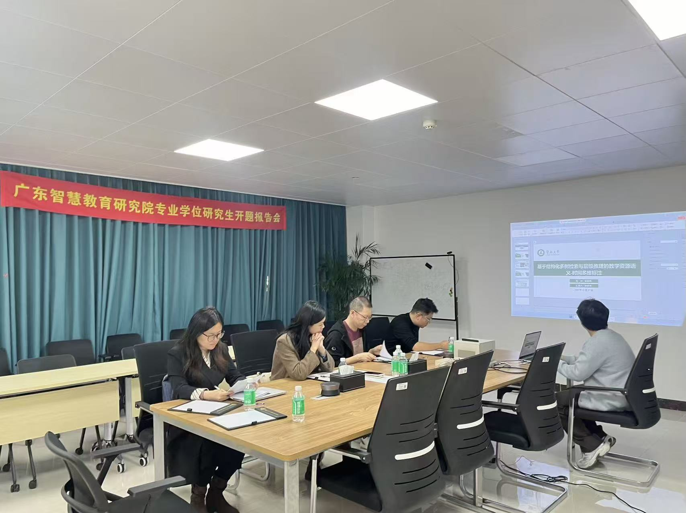

```{r}
#| eval: true 
#| echo: false
#| fig-align: "center"
#| out-width: "70%" 

```

::: {.center-text}
**Photo of my students and me**
:::

<br>

## Additional Photos

```{r}
#| eval: true 
#| echo: false
#| fig-align: "center"
#| out-width: "100%"

```

::: {.center-text}
**Another moment of my students**
:::

```{r}
#| eval: true 
#| echo: false
#| fig-align: "center"
#| out-width: "100%"

```

::: {.center-text}
**Serving as a defense committee member during the defense**
:::

```{r}
#| eval: true 
#| echo: false
#| fig-align: "center"
#| out-width: "100%"

```

::: {.center-text}
**Group photo of the defense committee members**
:::

<br>

# Abstract

The master's thesis proposal defense presented the research motivation, related work, methodology, and planned experiments. The committee provided constructive feedback on narrowing problem scope, clarifying evaluation metrics, and articulating expected contributions. Next steps include refining the proposal, aligning milestones with the semester plan, and preparing the first batch of experiments.


# Event Details

- **Date:** December 10, 2025
- **Event:** Master's Thesis Proposal Defense
- **Focus:** Research motivation, methodology, expected contributions, and timeline

