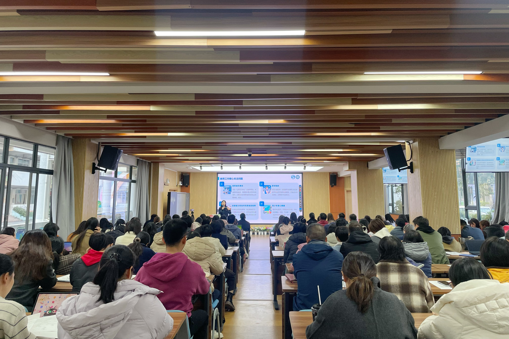
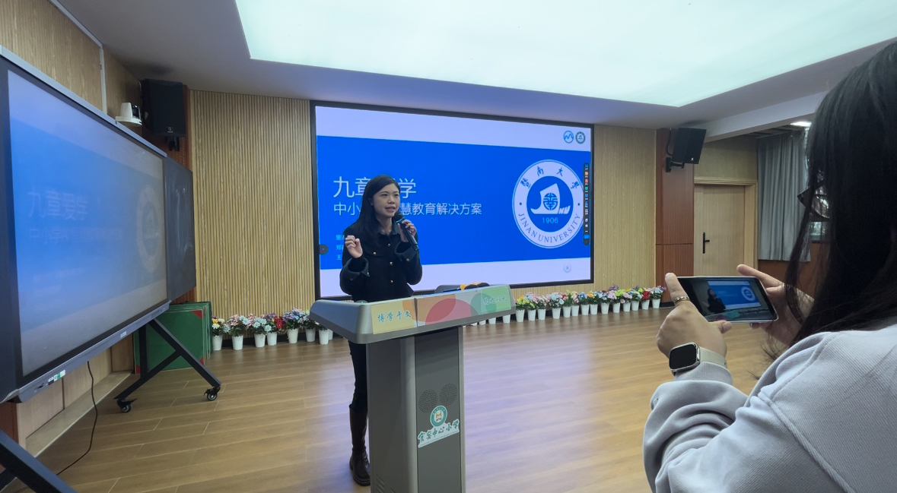
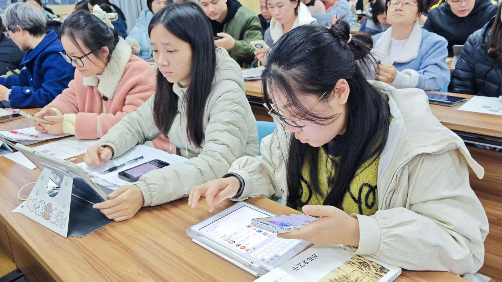

```{r}
#| eval: true 
#| echo: false
#| fig-align: "center"
#| out-width: "70%" 

```

::: {.center-text}
**"Jiuzhang Aixue" project first teacher application practical training launch**
:::

<br>

## Additional Photos

```{r}
#| eval: true 
#| echo: false
#| fig-align: "center"
#| out-width: "100%"

```

::: {.center-text}
**Associate Professor Jia-Qi Zheng delivering the training**
:::

```{r}
#| eval: true 
#| echo: false
#| fig-align: "center"
#| out-width: "100%"

```

::: {.center-text}
**Hands-on practice session for teachers**
:::

```{r}
#| eval: true 
#| echo: false
#| fig-align: "center"
#| out-width: "100%"

```

::: {.center-text}
**Interactive session with teachers**
:::

```{r}
#| eval: true 
#| echo: false
#| fig-align: "center"
#| out-width: "100%"

```

::: {.center-text}
**Group photo and certificate presentation**
:::

<br>

# Abstract

On January 5, 2026, the first teacher application practical training for the "Jiuzhang Aixue Primary and Secondary Smart Education Platform" Nanhai Zone Project kicked off at the Mingde Campus of Guanyao Central Primary School. 

The training was delivered by **Associate Professor Jia-Qi Zheng** and **Associate Researcher Wang Fengyi** from the Guangdong Institute of Smart Education at Jinan University. The session focused on the practical application of the "Jiuzhang Aixue" platform, demonstrating AI Q&A and precision practice for students, and the "Jiuzhang Aixue Teacher Intelligent Agent" for teachers to generate lesson plans and assist in teaching design.

# Event Details

- **Date:** January 6, 2026
- **Location:** Guanyao Central Primary School (Mingde Campus)
- **Host Institution:** Guanyao Central Primary School, Nanhai District
- **Speakers:** Jia-Qi Zheng, Fengyi Wang
