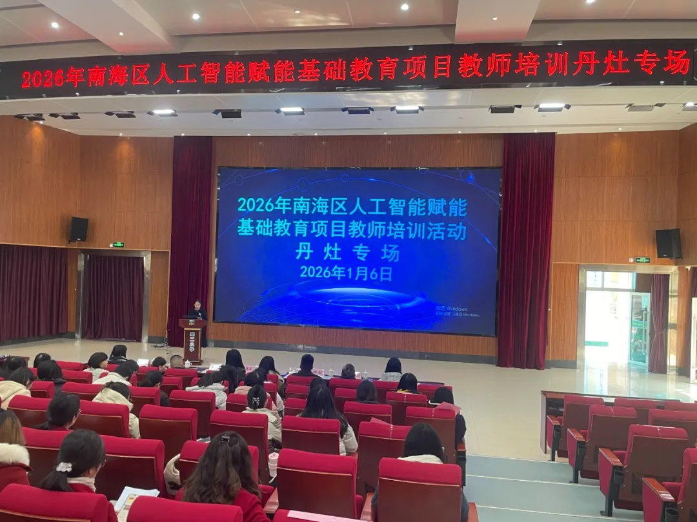
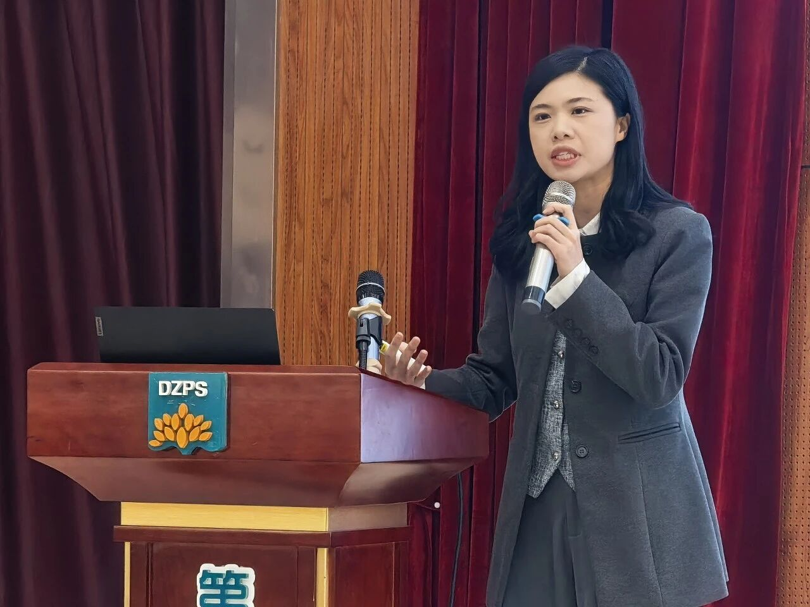
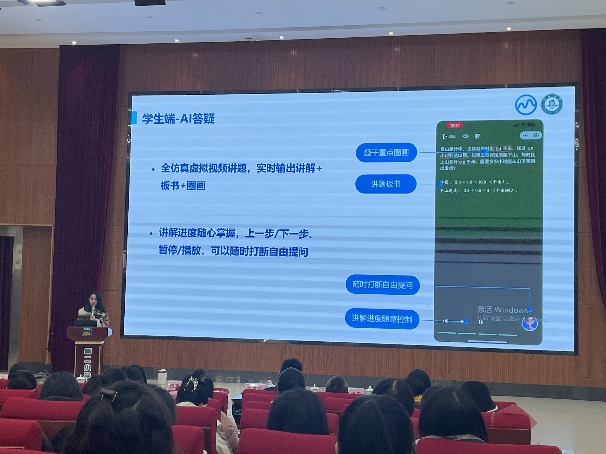
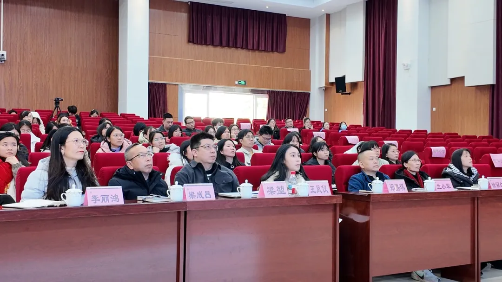

```{r}
#| eval: true 
#| echo: false
#| fig-align: "center"
#| out-width: "70%" 

```

::: {.center-text}
**Danzao specialized training session**
:::

<br>

## Additional Photos

```{r}
#| eval: true 
#| echo: false
#| fig-align: "center"
#| out-width: "100%"

```

::: {.center-text}
**Associate Professor Jia-Qi Zheng presenting platform values**
:::

```{r}
#| eval: true 
#| echo: false
#| fig-align: "center"
#| out-width: "100%"

```

::: {.center-text}
**Associate Researcher Wang Fengyi demonstrating practical operations**
:::

```{r}
#| eval: true 
#| echo: false
#| fig-align: "center"
#| out-width: "100%"

```

::: {.center-text}
**Training session in progress**
:::

<br>

# Abstract

On the afternoon of January 6, 2026, the "2026 Nanhai District Artificial Intelligence Empowering Basic Education Project Danzao Special Teacher Training" was successfuly held at Danzao Town Second Primary School.

**Associate Professor Jia-Qi Zheng** and **Associate Researcher Wang Fengyi** from the Guangdong Institute of Smart Education at Jinan University provided specialized sharing and practical training. Professor Zheng highlighted the platform's core values in reducing burdens and personalized education, while Researcher Wang conducted practical demonstrations of student and teacher agent functions.

# Event Details

- **Date:** January 6, 2026
- **Location:** Danzao Town Second Primary School
- **Host Institution:** Danzao Town Education Development Center
- **Speakers:** Jia-Qi Zheng, Fengyi Wang
