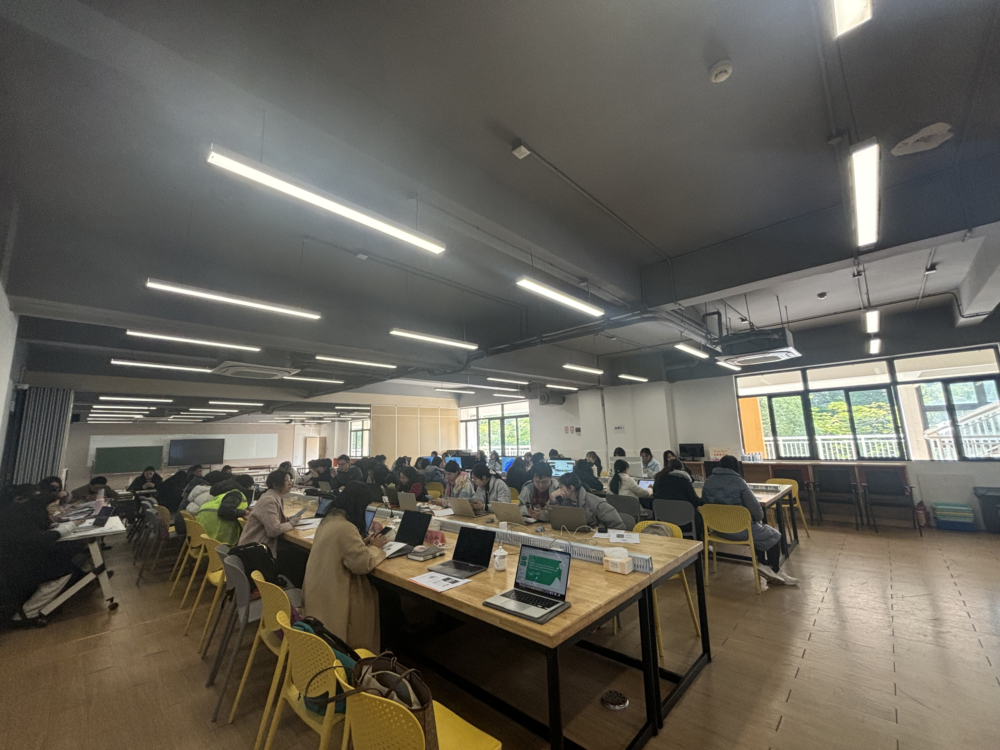
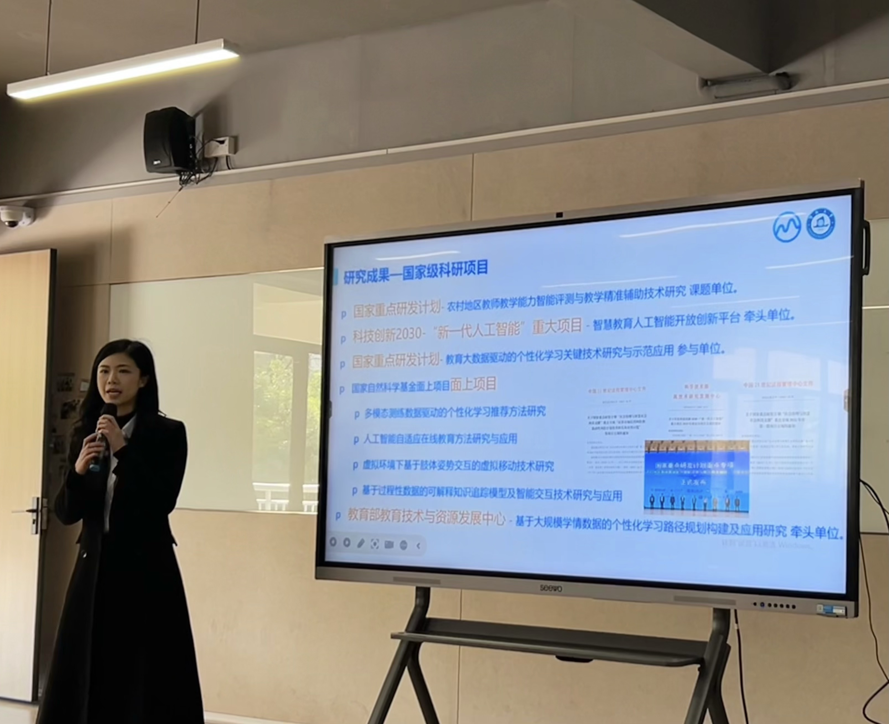
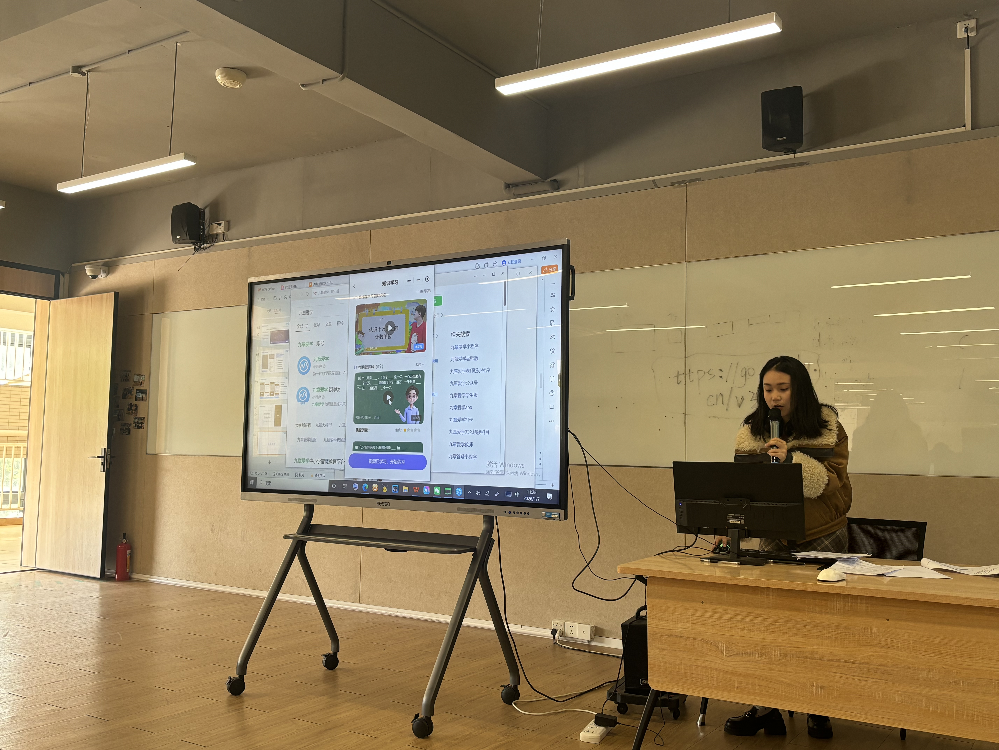

```{r}
#| eval: true 
#| echo: false
#| fig-align: "center"
#| out-width: "70%" 

```

::: {.center-text}
**Nanhai Central Primary School training session**
:::

<br>

## Additional Photos

```{r}
#| eval: true 
#| echo: false
#| fig-align: "center"
#| out-width: "100%"

```

::: {.center-text}
**Associate Professor Jia-Qi Zheng introducing the platform**
:::

```{r}
#| eval: true 
#| echo: false
#| fig-align: "center"
#| out-width: "100%"

```

::: {.center-text}
**Associate Researcher Wang Fengyi explaining core modules**
:::

<br>

# Abstract

On the morning of January 7, 2026, Nanhai Central Primary School successfully held the "Jiuzhang Aixue Primary and Secondary Smart Education Platform" teacher application practical training.

**Associate Professor Jia-Qi Zheng** and **Associate Researcher Wang Fengyi** from the Guangdong Institute of Smart Education at Jinan University were invited to give lectures. They introduced the platform's core concepts, architecture, and highlights, and guided teachers in practical operations of AI precision learning and intelligent Q&A modules to promote the deep integration of AI technology and education.

# Event Details

- **Date:** January 7, 2026
- **Location:** Nanhai Central Primary School
- **Host Institution:** Nanhai Central Primary School
- **Speakers:** Jia-Qi Zheng, Fengyi Wang
