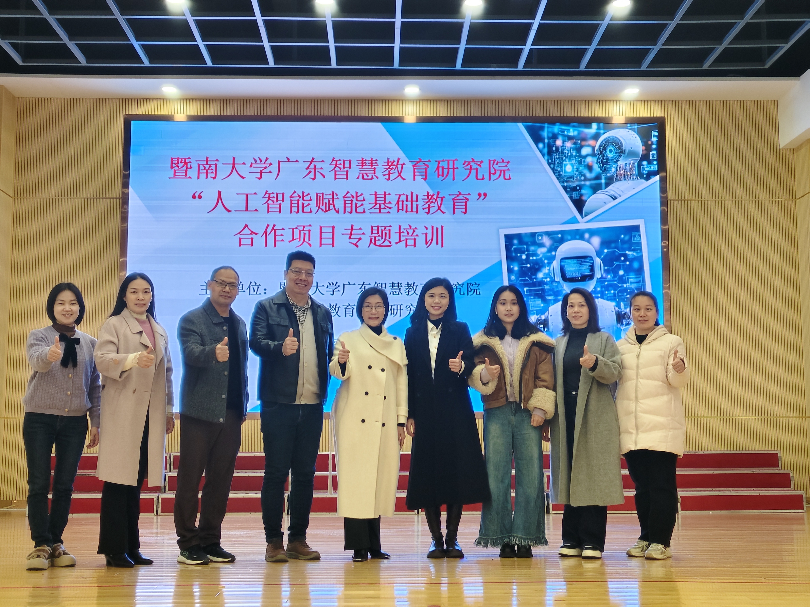
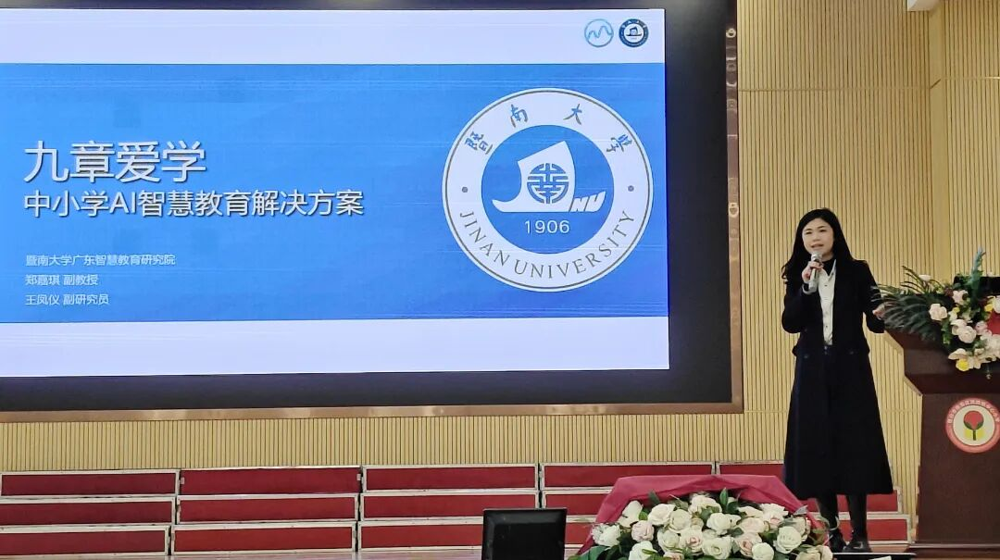
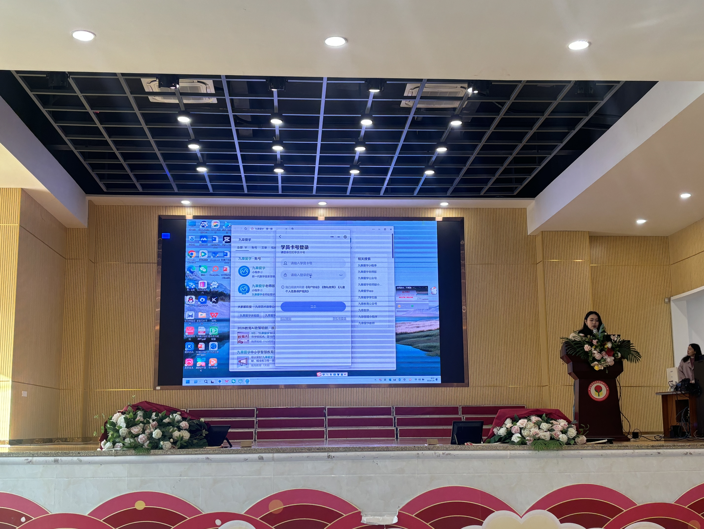

```{r}
#| eval: true 
#| echo: false
#| fig-align: "center"
#| out-width: "70%" 

```

::: {.center-text}
**Group photo at the end of the training**
:::

<br>

## Additional Photos

```{r}
#| eval: true 
#| echo: false
#| fig-align: "center"
#| out-width: "100%"

```

::: {.center-text}
**Associate Professor Jia-Qi Zheng explaining the platform**
:::

```{r}
#| eval: true 
#| echo: false
#| fig-align: "center"
#| out-width: "100%"

```

::: {.center-text}
**Associate Researcher Wang Fengyi conducting practical guidance**
:::

<br>

# Abstract

On the morning of January 8, 2026, Xiqiao Town Central Primary School held a special training on "Artificial Intelligence Empowering Basic Education".

The event featured **Associate Professor Jia-Qi Zheng** and **Associate Researcher Wang Fengyi** from the Guangdong Institute of Smart Education at Jinan University. They provided a systematic explanation and demonstration of the "Jiuzhang Aixue" platform's architecture, functions, and teaching application scenarios, helping teachers understand how to use AI tools for classroom interaction and personalized learning diagnosis.

# Event Details

- **Date:** January 8, 2026
- **Location:** Xiqiao Town Central Primary School
- **Host Institution:** Xiqiao Town Central Primary School
- **Speakers:** Jia-Qi Zheng, Fengyi Wang
