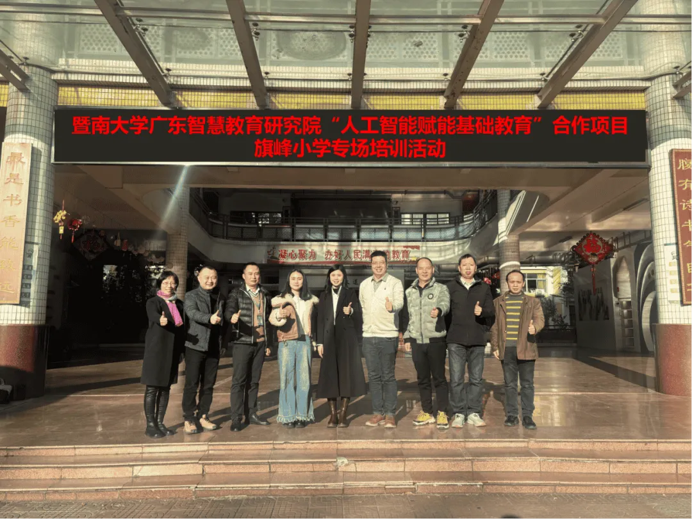
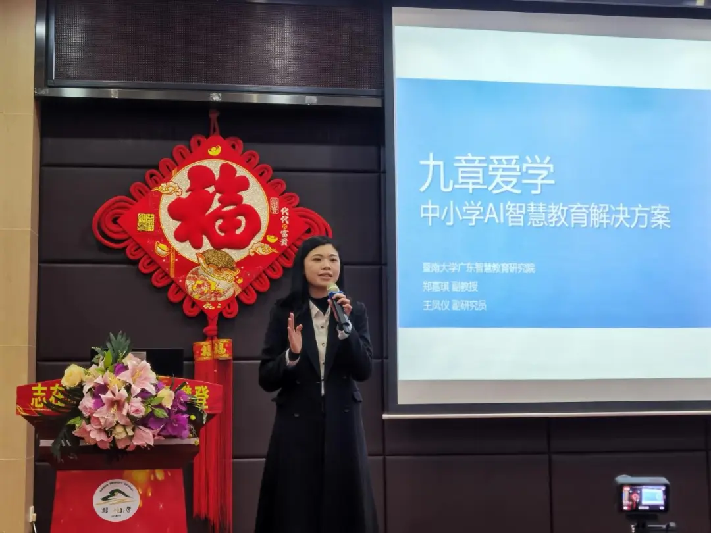
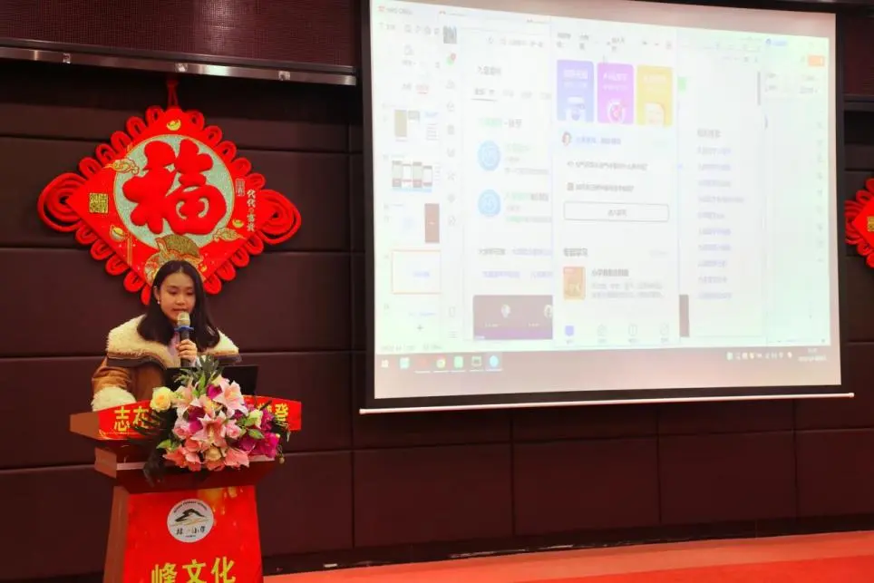

```{r}
#| eval: true 
#| echo: false
#| fig-align: "center"
#| out-width: "70%" 

```

::: {.center-text}
**Specialized training session at Qifeng Primary School**
:::

<br>

## Additional Photos

```{r}
#| eval: true 
#| echo: false
#| fig-align: "center"
#| out-width: "100%"

```

::: {.center-text}
**Associate Professor Jia-Qi Zheng explaining platform solutions**
:::

```{r}
#| eval: true 
#| echo: false
#| fig-align: "center"
#| out-width: "100%"

```

::: {.center-text}
**Associate Researcher Wang Fengyi guiding teachers**
:::


<br>

# Abstract

On January 8, 2026, **Qifeng Primary School** in Lishui Town, Nanhai District, hosted a specialized training session on the "Jiuzhang Aixue" AI teaching platform.

**Associate Professor Jia-Qi Zheng** and **Associate Researcher Wang Fengyi** from the Guangdong Institute of Smart Education at Jinan University were invited to conduct the training. The session aimed to address key educational challenges such as heavy teacher workload and the difficulty of personalized teaching. Through system demonstrations and practical exercises, teachers gained in-depth experience with the platform's core functions, including AI Q&A, precision learning, and intelligent correction, empowering them to explore new paths for precision teaching.

# Event Details

- **Date:** January 8, 2026
- **Location:** Qifeng Primary School, Lishui Town, Nanhai District
- **Event:** "Jiuzhang Aixue" AI Teaching Platform Specialized Training
- **Speakers:** Jia-Qi Zheng, Fengyi Wang
