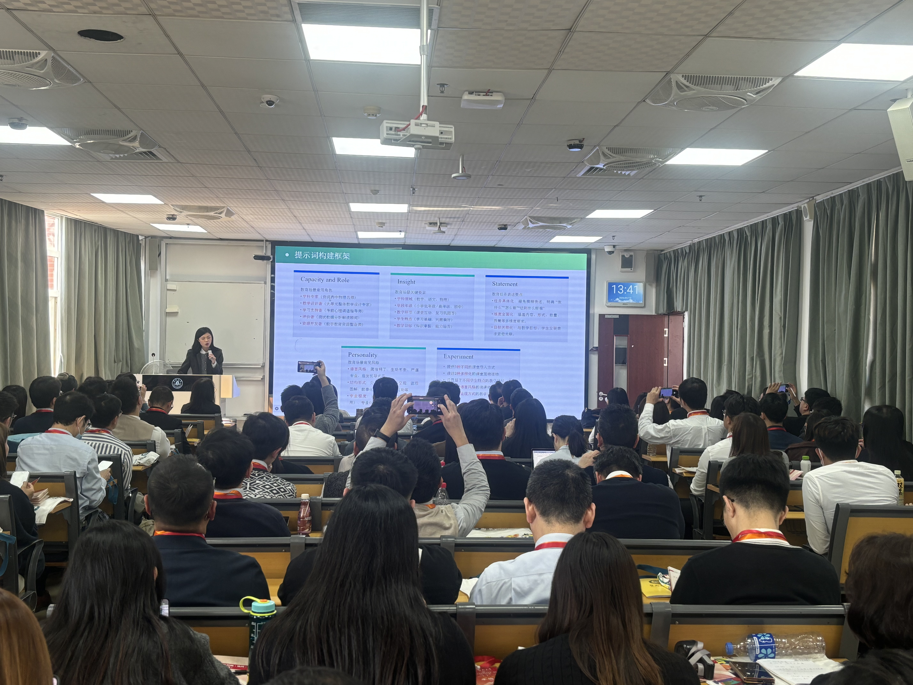
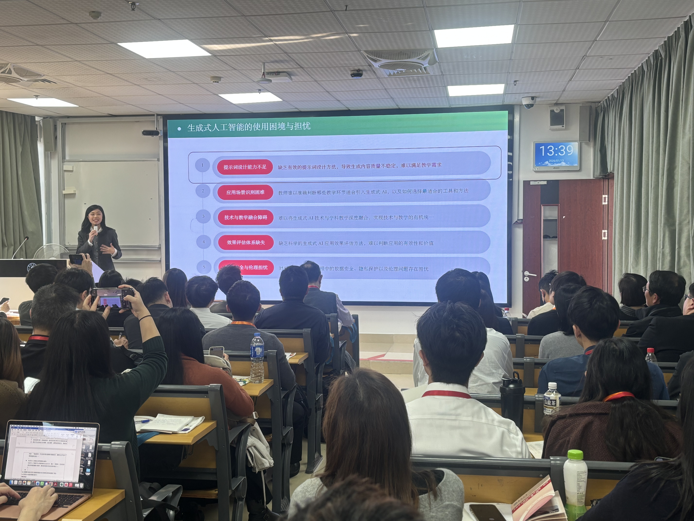
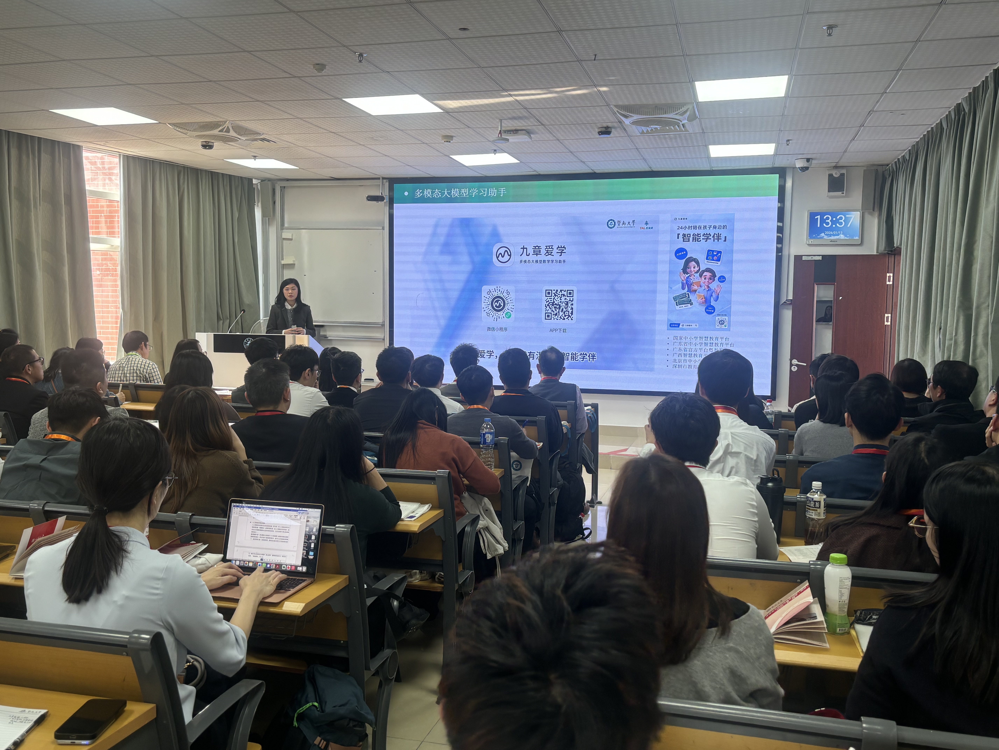

```{r}
#| eval: true 
#| echo: false
#| fig-align: "center"
#| out-width: "70%" 

```

::: {.center-text}
**Training session for Hong Kong Promoted Teachers**
:::

<br>

## Additional Photos

```{r}
#| eval: true 
#| echo: false
#| fig-align: "center"
#| out-width: "100%"

```

::: {.center-text}
**Teachers engaging in practical application**
:::

```{r}
#| eval: true 
#| echo: false
#| fig-align: "center"
#| out-width: "100%"

```

::: {.center-text}
**Expert guidance on platform features**
:::

<br>

# Abstract

On January 13, 2026, the **Hong Kong Promoted Teachers Delegation** participated in a specialized training session on the "Jiuzhang Aixue" platform at Jinan University.

**Associate Professor Jia-Qi Zheng** from the Guangdong Institute of Smart Education at Jinan University guided the delegation. The workshop focused on the practical application of the "Jiuzhang Aixue" platform, aiming to equip the visiting educators with advanced AI tools to enhance teaching efficiency, foster educational innovation, and explore new methods for integrating AI into the classroom.

# Event Details

- **Date:** January 13, 2026
- **Location:** Jinan University, Guangzhou
- **Event:** "Jiuzhang Aixue" Training for Hong Kong Promoted Teachers
- **Speakers:** Jia-Qi Zheng
