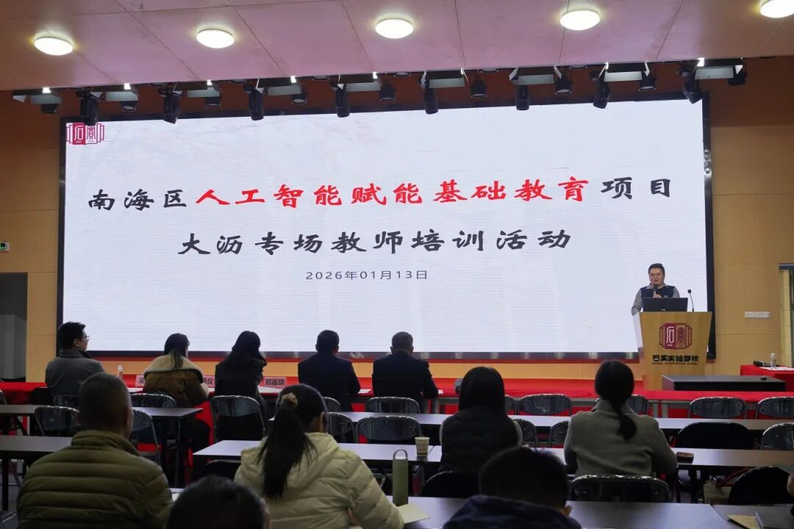
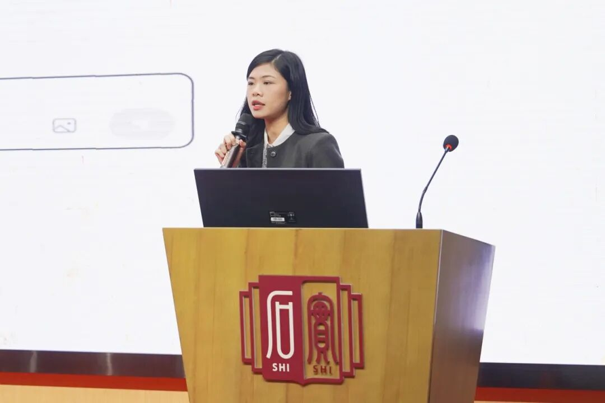
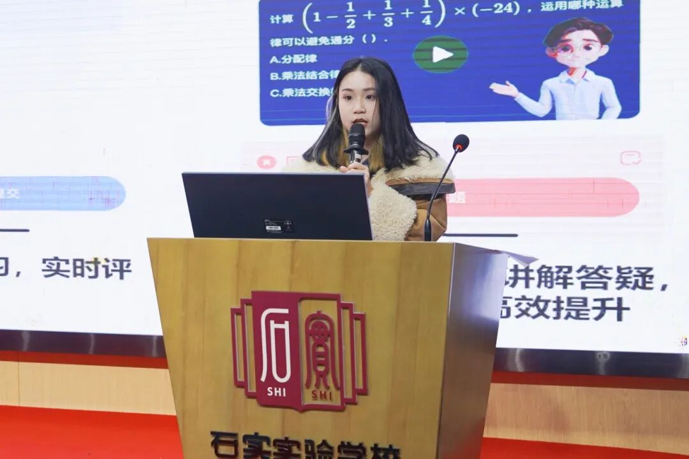

```{r}
#| eval: true 
#| echo: false
#| fig-align: "center"
#| out-width: "70%" 

```

::: {.center-text}
**Training session at Shishi Experimental School**
:::

<br>

## Additional Photos

```{r}
#| eval: true 
#| echo: false
#| fig-align: "center"
#| out-width: "100%"

```

::: {.center-text}
**Professor Jia-Qi Zheng explaining platform values**
:::

```{r}
#| eval: true 
#| echo: false
#| fig-align: "center"
#| out-width: "100%"

```

::: {.center-text}
**Researcher Wang Fengyi demonstrating practical operations**
:::

```{r}
#| eval: true 
#| echo: false
#| fig-align: "center"
#| out-width: "100%"

```

::: {.center-text}
**Teachers in the practical application session**
:::

<br>

# Abstract

On January 13, 2026, the **2026 Nanhai District Artificial Intelligence Empowering Basic Education Project Dali Special Teacher Training** was successfully held at Shishi Experimental School.

**Professor Jia-Qi Zheng** and **Researcher Wang Fengyi** from the Guangdong Institute of Smart Education at Jinan University conducted the training. The session focused on the practical application of the "Jiuzhang Aixue" platform. Professor Zheng interpreted the platform's core values, while Researcher Wang provided detailed demonstrations of functions like AI lesson preparation and learning analysis, helping teachers unlock new skills for AI-integrated teaching.

# Event Details

- **Date:** January 13, 2026
- **Location:** Shishi Experimental School, Nanhai District
- **Event:** AI Empowering Basic Education Training (Dali Special Session)
- **Speakers:** Jia-Qi Zheng, Fengyi Wang
